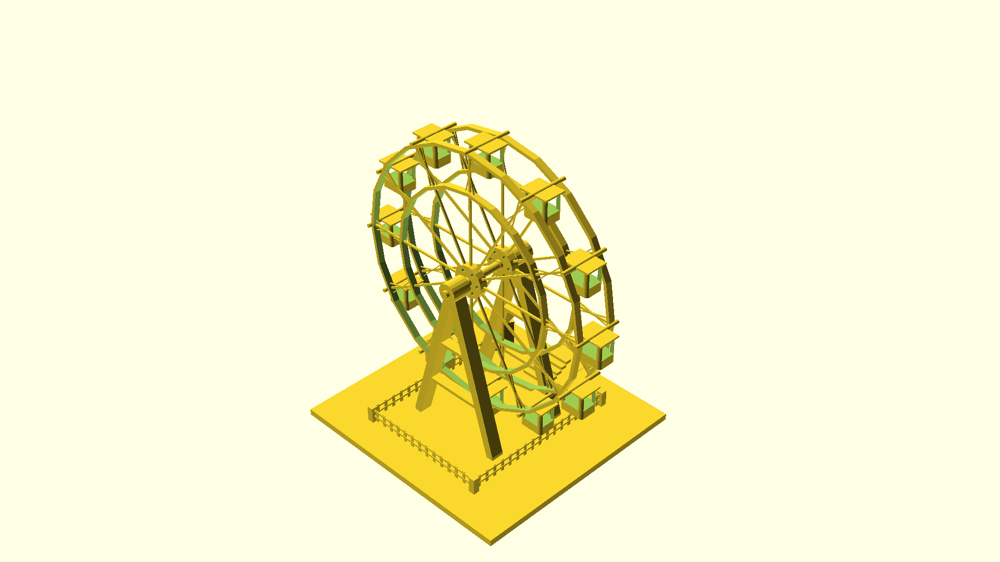

# scad-mcp

Python MCP server for OpenSCAD design and rendering utilities.

## Requirements

- Python 3.12
- OpenSCAD installed and available in PATH or configured via --openscad-path argument
- uv for dependency management

## Run the MCP server


To specify the OpenSCAD executable path, pass it as a command-line argument when running the server:
 
```bash
uv run scad-mcp --openscad-path "C:\Program Files\OpenSCAD\openscad.exe"
```

For MCP configuration (e.g., in `.trae/mcp.json`):
 
```json
{
  "mcpServers": {
    "scad-mcp": {
      "command": "uv",
      "args": [
        "run",
        "scad-mcp",
        "--openscad-path",
        "C:\\Program Files\\OpenSCAD\\openscad.exe"
      ]
    }
  }
}
```

## Tools

### OpenSCAD installation checker

Inputs: none

Outputs:

- found: bool
- path: str | None
- version: str | None
- details: str

### SCAD model renderer

Inputs:

- scad_file: path to .scad file
- projection: perspective or orthographic
- fov: 1 to 120
- angles: one, two, or three of top, bottom, front, back, left, right
- output_dir: optional output folder

The renderer names output files using:

```
<stem>_<projection>_fov<FOV>_<angle1[-angle2][-angle3]>.png
```

Example usage:

'''json
{
  "angles": [
    "top",
    "front",
    "right"
  ],
  "scad_file": "\**\scad-mcp\examples\ferris_wheel.scad",
  "projection": "perspective",
  "fov": 45,
  "img_height": 1080,
  "img_width": 1920,
  "output_dir": "\**\scad-mcp\examples"
}
'''

This command renders the ferris wheel model from a viewpoint that is the average of the front, left, and top camera angles. This is useful for getting an isometric-like perspective that shows depth and detail from multiple sides.



## Testing

```bash
uv run pytest
```

Integration tests will skip if OpenSCAD is not installed.
